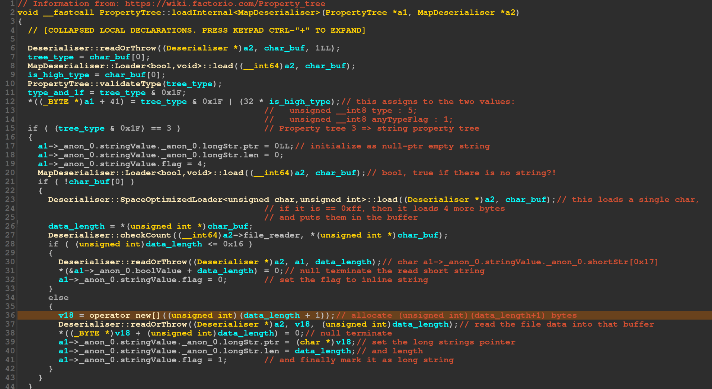
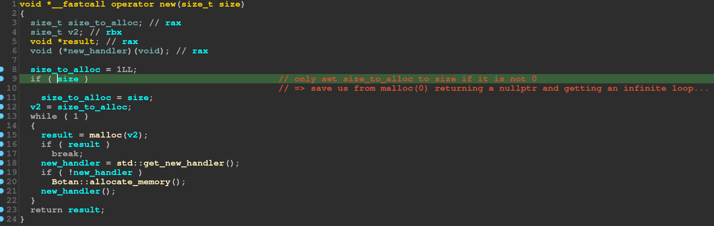
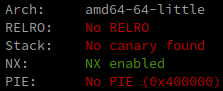
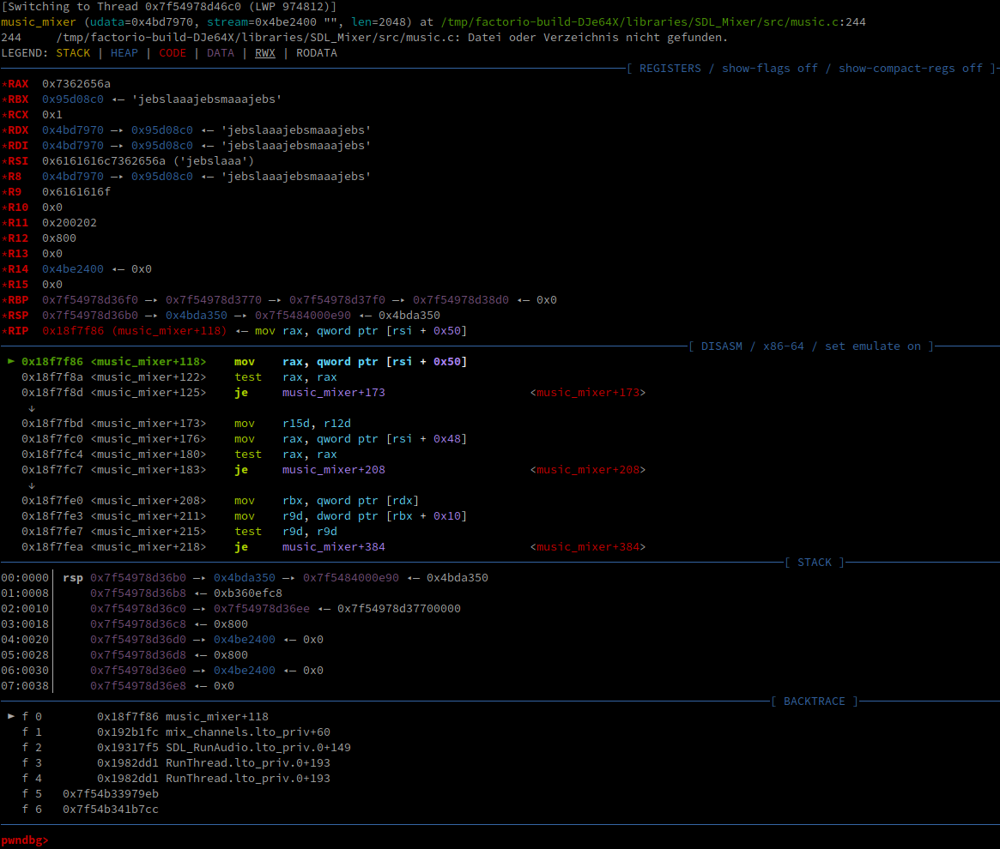
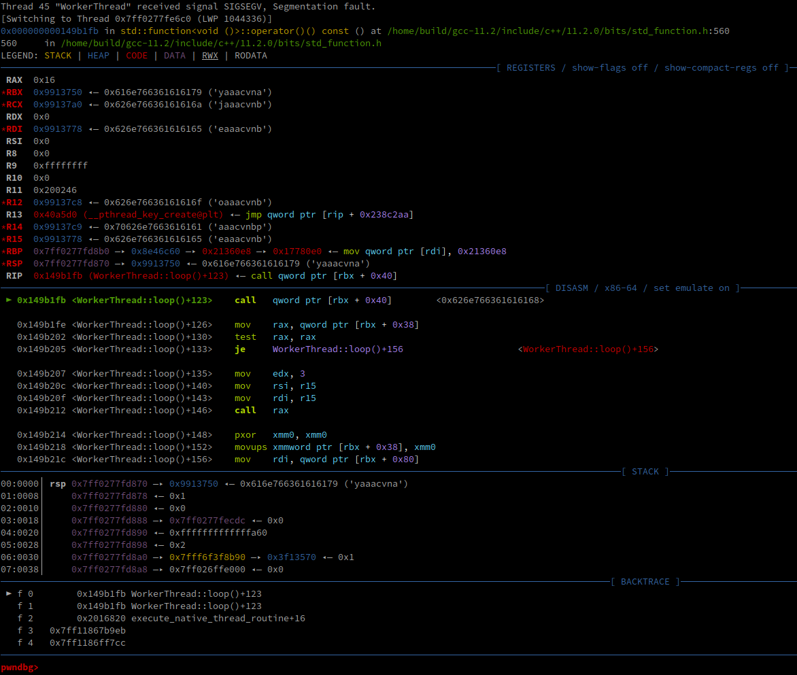

# Abstract

In September 2023 we found a buffer overflow vulnerability in Factorio.
This vulnerability allows for arbitrary code execution when loading or previewing a modified save file.
We have reported the vulnerability alongside a proof-of-concept to the Factorio team,
and a fix has been released with game version 1.1.94 on October 30th 2023.

# Factorio:


[Factorio](https://factorio.com/) is a factory automation game.
It has sold about 3.5 million copies on multiple platforms,
including Windows, Linux, macOS, the Steam Deck and the Nintendo Switch.

It's very popular among computer science students,
as it's the best parts of programming without any of the boring/exhausting parts.

## Finding the bug:

Opening factorio in IDA to reverse engineer was just a fun project, but since
I am very interested in security understanding the parsers was a first goal.
Most of it seemed pretty sane and uses C++ dynamic sized types.

There's not really a lot to say about how to reverse engineer a game, you open
it in a disassembler, attach a debugger, find resources online and just piece
stuff together piece by piece. At this point a big thanks to the developers for
giving us debug symbols, however they could at least enable PIE.

There's not really a lot to say, except that following strings and function names
into level loading code until I found the part which loads property-trees from
maps, again it seems sane in that it always tries to allocate enough memory for
the entire data part.



## The bug:

The bug lies within the way this number of bytes to allocate is computed. Because
the number is cast to a 32-bit integer we can enter a number such that this value
gets too small (and thus we will be able to overwrite a whole bunch of stuff on the heap)

Namely this will always give us an overflow of (a multiple of) 4gb.
However since we only read 4 bytes as size the only way we will overflow if this is
exactly one byte short of 4 gigabyte. Sadly this means that
the mapfile also needs to be this big, else the mapdeserializer will complain that
there simply is not enough data to even attempt deserialization.

There also exists a small piece to implement a custom operator new[] in this C++
project, which first checks if the size to allocate is zero, if yes it will set it to 1
(e.g. no allocation will return nullptr), then it will go into a while true to try
and allocate with malloc and then the `std::get_new_handler` way.



## The exploit:

We have developed the proof of concept exploit on an `amd64` linux machine,
and are using the **linux native** version of factorio.

### Recon:

If we inspect the factorio binary with `checksec`, we get the following:



The game itself is written in C++ and compiled as a **non position independent executable**.
This allows us to hardcode any addresses we need for our exploit,
without having to worry about ASLR.

As we have an overflow of ~4GiB in size, we will overwrite a massive section of the program heap.

The first step is to create a fake save file with modified size specifications,
filled with a [non-repeating pattern](https://en.wikipedia.org/wiki/De_Bruijn_sequence).
Once we preview this save file, factorio will crash with a segmentation fault.
If we attach a debugger, we can observe multiple crashes, in multiple threads:

This appears to a thread responsible for audio.
It's attempting to read from an invalid address (we have seeded `rsi` with our pattern).
This does not appear to be immediately exploitable, so we continue our search.


The next thread is a worker thread.
Immediately we notice multiple interesting things:

1. The thread is attempting to execute a jump
   
2. The jump target is read from the location pointed at by `rbx + 0x40`
3. `RBX` is pointing into our pattern --> we control the jump target
   
4. `RCX` is pointing into our pattern a few bytes after `RBX`
   

--> We can use this to perform a stack pivot (with the gadget `0x2043fa4: mov rsp, rcx; ret;`),
build a ROP chain and execute arbitrary code.

### Chain construction:

We can not simply write shellcode into our pattern, as the heap is marked as non-executable.
Instead, we will use a technique
called [return oriented programming](https://en.wikipedia.org/wiki/Return-oriented_programming).
Essentially, we will reuse a series of existing instructions in the factorio binary to construct our exploit.

[Ropper](https://github.com/sashs/Ropper) reports `638593 gadgets found`.

As we have plenty of space on the chain and don't want to bother ourselves with the libc,
we manually execute a syscall.

We need 5 gadgets for the main chain:

1. `0x40e86b: pop rax; ret;` --> load syscall number into `rax`
2. `0x40e150: pop rdi; ret;` --> load first argument into `rdi`
3. `0x40e2d4: pop rsi; ret;` --> load second argument into `rsi`
4. `0x42c4d6: syscall;` --> execute syscall (`sys_execve` - syscall number `59`)
5. `0x1c73b08: mov qword ptr [rax], rsi; ret;` --> modify memory (used to specify target program and arguments)

We will execute our target program `get_flag`:

```bash
/bin/get_flag
```

In addition to the main chain, we need our stack pivot gadget:

- `0x2043fa4: mov rsp, rcx; ret;`

As the load location of our modified save file is a bit flaky,
we insert a ret slide which is easier to target than our main chain.

We place the address of the ret slide and the address of the stack pivot gadget
in the first section of our savefile in an interleaving, repeating pattern.
The jump will now target the pivot gadget,
which will point the stack pointer at our ret slide.
We place the ret slide itself in the second section of our save file,
so that it is loaded at a somewhat predictable location after the binary base.
At the end of the ret slide we place the main chain to execute our target program.
