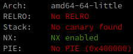

# Abstract

In September 2023 we found a buffer overflow vulnerability in Factorio.
This vulnerability allows for arbitrary code execution when loading or previewing a modified save file.
A fix has been released with game version 1.1.94 on October 30th 2023.

# Factorio

[Factorio](https://factorio.com/) is a factory automation game.

It's very popular among computer science students,
as it's the best parts of programming without any of the boring/exhausting parts.

## Finding the bug

## The bug

## The exploit:
If we inspect the factorio binary with `checksec`, we get the following:

We are developing the proof of concept exploit on an `amd64` linux machine,
and are using the **linux native** version of factorio.

The game itself is written in C++ and compiled as a non position independent executable.
This allows us to hardcode any addresses we need for our exploit without having to worry about ASLR.

## Reporting process
