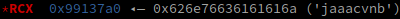

# Abstract

**From save game to remote code execution**

In September 2023 we found a buffer overflow vulnerability in Factorio.
This vulnerability allows for arbitrary code execution when loading or previewing a modified save file.
We have reported the vulnerability alongside a proof-of-concept to the Factorio team,
and a fix has been released with game version 1.1.94 on October 30th 2023.

# Factorio:

[](https://factorio.com/)
[Factorio](https://factorio.com/) is a factory automation game.
It has sold about 3.5 million copies on multiple distribution platforms and operating systems;
including Windows, Linux, macOS, the Steam Deck and the Nintendo Switch.

The game is programmed in C++ in a custom engine.
It supports a large online multiplayer and modding community.

It's very popular among computer science students,
as it's the best parts of programming without any of the boring/exhausting parts.

## Exploring the binary:

Opening factorio in IDA to reverse engineer was a fun project.
Since we are interested in security critical aspects,
understanding the parser was a first goal.
Most of it seemed pretty sane and uses C++ dynamic sized types.

Reverse engineering a game isn't fundamentally different from a normal binary.
You open it in a disassembler, attach a debugger, find resources online, and piece stuff together piece by piece.
At this point a big thanks to the developers for giving us debug symbols;
although we do recommend that they enable PIE for future builds.

Following strings and function names,
we eventually found the code responsible for loading save files.
This function loads a [PropertyTree](https://wiki.factorio.com/Property_tree) from a save file.
In order to be efficient, it allocates enough memory for the entire data section of the file in advance.


## The bug:

The bug lies in way this number of bytes to allocate is computed (see marked line `36`).

Because the result of `data_length + 1` is cast to a 32-bit unsigned integer,
we can enter a number that causes a wrap-around to zero after the addition.
As the deserializer is given a deserialization length of `data_length`,
it will attempt to read `data_length` bytes into a buffer of size `1`,
overwriting a massive section of the heap in the process.

Specifically, this will always give us an overflow of (a multiple of) 4GiB.
Since we only read 4 bytes as size,
the only way we will overflow if this is if we are exactly one byte short of 4 gigabyte.
Sadly this means that in order for our exploit to work,
the map file also needs to be exactly this big.
Otherwise, the MapDeserializer will complain that there is not enough data in order to attempt deserialization.

In case you were wondering why `new[]` with a size of zero does not return a `nullptr`;
there exists a small piece to implement a custom `operator new[]` in this C++ project,
which first checks if the size to allocate is zero,
and if so, sets the allocation size to 1 (i.e. no allocation will return nullptr).
It will then go into a while true loop,
where it will first attempt to allocate memory with `malloc`,
and if that fails, attempt to remedy the situation with `std::get_new_handler`.


## The exploit:

We have developed the proof of concept exploit on an `amd64` linux machine,
and are using the **linux native** version of factorio.

### Recon:

If we inspect the factorio binary with `checksec`, we get the following:


The game itself is written in C++ and compiled as a **non position independent executable**.
This allows us to hardcode any addresses we need for our exploit,
without having to worry about ASLR.

As we have an overflow of ~4GiB in size, we will overwrite a massive section of the program heap.

The first step is to create a fake save file with modified size specifications,
filled with a [non-repeating pattern](https://en.wikipedia.org/wiki/De_Bruijn_sequence).
Once we preview this save file, factorio will crash with a segmentation fault.
If we attach a debugger, we can observe multiple crashes, in multiple threads:

This appears to a thread responsible for audio.
It's attempting to read from an invalid address (we have seeded `rsi` with our pattern).
This does not appear to be immediately exploitable, so we continue our search.


The next thread is a worker thread.
Immediately we notice multiple interesting things:

1. The thread is attempting to execute a jump
   
2. The jump target is read from the location pointed at by `rbx + 0x40`
3. `RBX` is pointing into our pattern --> we control the jump target
   
4. `RCX` is pointing into our pattern a few bytes after `RBX`
   

--> We can use this to perform a stack pivot (with the gadget `0x2043fa4: mov rsp, rcx; ret;`),
build a ROP chain and execute arbitrary code.

### Chain construction:

We can not simply write shellcode into our pattern, as the heap is marked as non-executable.
Instead, we will use a technique
called [return oriented programming](https://en.wikipedia.org/wiki/Return-oriented_programming).
Essentially, we will reuse a series of existing instructions in the factorio binary to construct our exploit.

[Ropper](https://github.com/sashs/Ropper) reports `638593 gadgets found`.

As we have plenty of space on the chain and don't want to bother ourselves with the libc,
we manually execute a syscall.

We need 5 gadgets for the main chain:

1. `0x40e86b: pop rax; ret;` --> load syscall number into `rax`
2. `0x40e150: pop rdi; ret;` --> load first argument into `rdi`
3. `0x40e2d4: pop rsi; ret;` --> load second argument into `rsi`
4. `0x42c4d6: syscall;` --> execute syscall (`sys_execve` - syscall number `59`)
5. `0x1c73b08: mov qword ptr [rax], rsi; ret;` --> modify memory (used to specify target program and arguments)

We will execute our target program `get_flag`:

```bash
/bin/get_flag
```

In addition to the main chain, we need our stack pivot gadget:

- `0x2043fa4: mov rsp, rcx; ret;`

As the load location of our modified save file is a bit flaky,
we insert a ret slide,
which is easier to target than our main chain.

We place the address of the ret slide and the address of the stack pivot gadget
in the first section of our savefile in an interleaving, repeating pattern.
The jump will now target the pivot gadget,
which will point the stack pointer at our ret slide.
We place the ret slide itself in the second section of our save file,
so that it is loaded at a somewhat predictable location after the binary base.
At the end of the ret slide we place the main chain to execute our target program.

Now, once a modified save file is previewed,
the game will attempt to load its content to memory,
overwrite the heap with our data,
pivot the stack of a waiting worker thread onto our ROP-chain,
and execute our target program - giving us control over the target machine.


